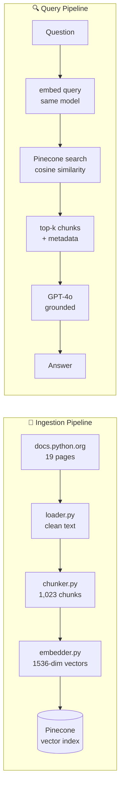
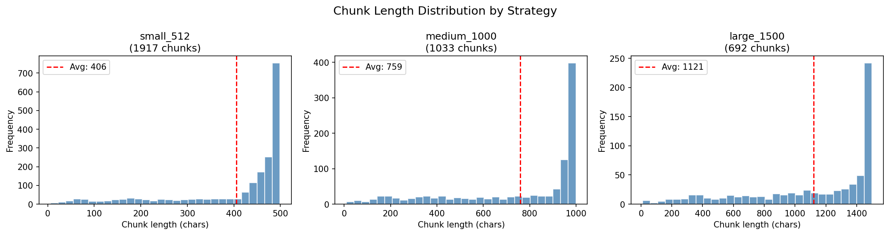

# RAG Python Docs — AI-Powered Question Answering over Python Documentation

A production-ready **Retrieval-Augmented Generation (RAG)** pipeline that answers natural language questions about Python using official documentation as the knowledge base.

Built with Python, LangChain, OpenAI, Pinecone, FastAPI, and AWS Lambda.

---

## Demo

```bash
$ python scripts/query.py "How does the asyncio event loop work?"

Q: How does the asyncio event loop work?
══════════════════════════════════════════════════════════════
The asyncio event loop is the core of every asyncio application.
It runs asynchronous tasks and callbacks, performs network I/O,
and runs subprocesses. Application developers typically use
high-level functions like asyncio.run()...

── Sources (5 chunks used) ──────────────────────────────────
  [advanced] Event loop
             https://docs.python.org/3/library/asyncio-eventloop.html
```

---

## Architecture



---

## Stack

| Layer            | Technology                                  | Purpose                            |
| ---------------- | ------------------------------------------- | ---------------------------------- |
| Document Loading | BeautifulSoup4, requests                    | Scrape + parse Python docs         |
| Text Splitting   | LangChain RecursiveCharacterTextSplitter    | Chunk documents                    |
| Embeddings       | OpenAI `text-embedding-3-small` (1536 dims) | Vectorize chunks + queries         |
| Vector Store     | Pinecone Serverless (AWS us-east-1)         | Store + search vectors             |
| LLM              | GPT-4o (`temperature=0`)                    | Grounded answer generation         |
| Orchestration    | LangChain                                   | Pipeline coordination              |
| API Layer        | FastAPI + Uvicorn                           | REST microservice                  |
| Deployment       | AWS Lambda + API Gateway                    | Serverless cloud deployment        |
| Evaluation       | RAGAS                                       | Retrieval + answer quality metrics |

---

## Project Structure

```
rag-python-docs/
├── src/
│   ├── ingestion/
│   │   ├── loader.py          # Fetch + parse 19 Python docs pages
│   │   ├── chunker.py         # Recursive text splitting with metadata
│   │   └── embedder.py        # OpenAI embeddings + Pinecone upsert
│   ├── retrieval/
│   │   ├── retriever.py       # Dense vector similarity search
│   │   └── qa_chain.py        # GPT-4o answer generation over chunks
│   ├── api/                   # FastAPI service layer
│   └── evaluation/            # RAGAS eval harness
├── scripts/
│   ├── ingest.py              # End-to-end ingestion runner
│   └── query.py               # CLI query interface
├── notebooks/
│   └── experiments/
│       └── 01_chunking_strategies.ipynb   # Chunking strategy analysis
├── infra/
│   └── lambda/                # AWS deployment config
├── tests/
├── .env.example
├── pyproject.toml
└── requirements.txt
```

---

## Corpus

19 curated pages from `docs.python.org`, covering beginner through advanced Python:

| Section      | Pages                                                                                                                                            |
| ------------ | ------------------------------------------------------------------------------------------------------------------------------------------------ |
| Beginner     | Introduction, Control Flow, Data Structures, Modules, I/O, Errors, Classes                                                                       |
| Intermediate | Standard Library I & II                                                                                                                          |
| Advanced     | Functional Programming, Descriptors, Data Model, asyncio Tasks, asyncio Event Loop, concurrent.futures, itertools, functools, typing, contextlib |

**Ingestion stats:** 19 documents → 1,023 chunks → 1,023 vectors @ 1536 dims

---

## Quickstart

### Prerequisites

- Python 3.11+
- OpenAI API key (platform.openai.com — ~$0.004 to ingest full corpus)
- Pinecone account (free Starter tier sufficient)

### Setup

```bash
git clone https://github.com/AdityaKuchhal/rag-python-docs.git
cd rag-python-docs

python -m venv venv
source venv/bin/activate  # Windows: venv\Scripts\activate

pip install -r requirements.txt
pip install -e .
```

### Configure environment

```bash
cp .env.example .env
# Edit .env with your keys:
# OPENAI_API_KEY=sk-...
# PINECONE_API_KEY=pcsk_...
# PINECONE_INDEX_NAME=python-docs-rag
```

### Run ingestion

```bash
python scripts/ingest.py
```

Expected output:

```json
{
  "chunks_processed": 1023,
  "chunks_embedded": 1023,
  "vectors_upserted": 1023,
  "status": "success"
}
```

### Query the system

```bash
# Single question
python scripts/query.py "What is a Python decorator?"

# Filter by difficulty
python scripts/query.py "What is metaclass?" --section advanced

# Interactive REPL
python scripts/query.py --interactive

# More context chunks
python scripts/query.py "How do generators work?" --top-k 8
```

---

## Experiments

### Chunking Strategy Comparison

Experiment `01_chunking_strategies.ipynb` compared three chunking strategies across the same corpus:

| Strategy        | Chunk Size      | Overlap | Total Chunks | Avg Length    |
| --------------- | --------------- | ------- | ------------ | ------------- |
| small_512       | 500 chars       | 50      | 1,917        | 406 chars     |
| **medium_1000** | **1,000 chars** | **100** | **1,033**    | **759 chars** |
| large_1500      | 1,500 chars     | 150     | 692          | 1,121 chars   |

**Key finding:** All three strategies showed a hard spike at the chunk size ceiling — indicating Python docs paragraphs consistently exceed fixed chunk windows. The splitter is cutting mid-paragraph rather than at natural boundaries.

**Retrieval scores (production index — medium_1000):**

| Query              | Top-1 Score | Top-3 Avg |
| ------------------ | ----------- | --------- |
| asyncio event loop | 0.697       | 0.646     |
| Python generators  | 0.621       | 0.585     |
| metaclass          | 0.605       | 0.561     |
| list vs tuple      | 0.584       | 0.542     |
| Python decorator   | 0.487       | 0.480     |

Decorator scored lowest (0.487) — consistent with the mid-paragraph cut hypothesis, as decorator explanations span ~1500 chars of contiguous prose. Follow-up experiment with `chunk_size=2000` planned.

**Decision:** Retain `medium_1000` as production baseline. Flag semantic chunking as a future improvement.



---

## Design Decisions

**Why `text-embedding-3-small` over `text-embedding-3-large`?**
3-small delivers 95%+ of the retrieval quality at 5x lower cost and faster latency. For a documentation QA use case with clean, structured text, the larger model adds marginal value.

**Why `temperature=0` for GPT-4o?**
This is a factual QA system, not a creative one. Deterministic outputs make evaluation meaningful — the same question should produce the same answer every run.

**Why Pinecone Serverless over pod-based?**
Zero operational overhead, scales to zero when not in use, sufficient for this corpus size. Pod-based makes sense at 10M+ vectors or when sub-10ms P99 latency is required.

**Why store chunk content in Pinecone metadata?**
Avoids a secondary lookup to reconstruct the answer context. Tradeoff: metadata storage cost grows linearly with corpus size. Acceptable at this scale, revisit at 100k+ chunks.

---

## Cost Breakdown

| Operation                            | Cost            |
| ------------------------------------ | --------------- |
| Full corpus ingestion (1,023 chunks) | ~$0.004         |
| Per query (embedding + GPT-4o)       | ~$0.002–0.008   |
| Pinecone Serverless storage          | Free tier (2GB) |

---

## License

MIT
